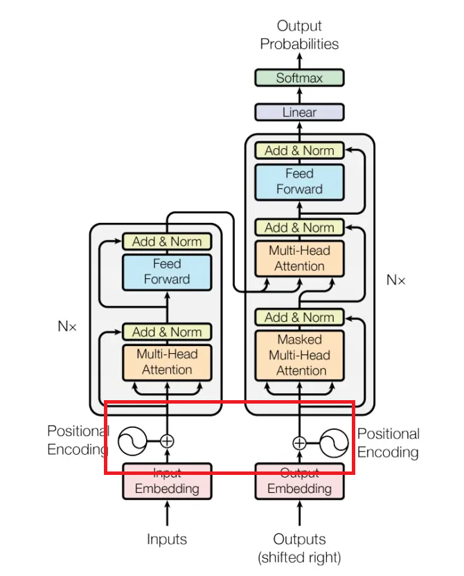
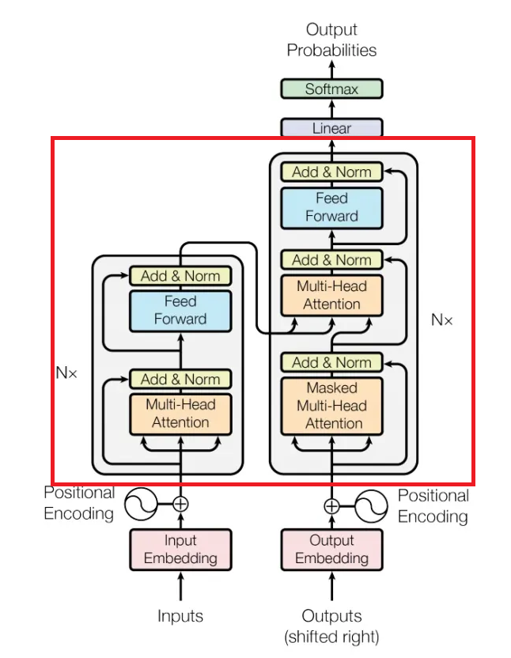
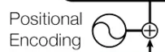
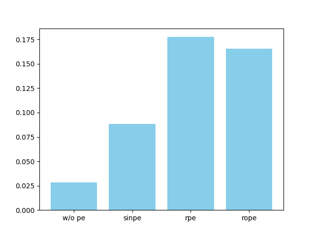
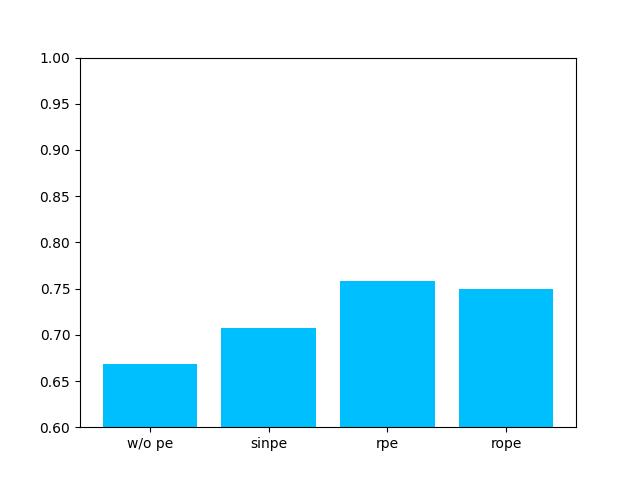

# Explorations of position encodings: technical report & analysis

# 1. Introduction
## Positional Encodings
### Why Positional Encodings?
RNN的输入在时序上的先后顺序隐含了位置信息，而Attention并行地计算所有位置的注意力分数，没有相对位置信息，无法感知单词之间的距离。因此为了获得位置和距离的相关信息，就需要额外加入位置编码。


### Sinusoidal Positional Encoding
正余弦位置编码是transformer原论文中使用的编码方式，它将每个绝对位置的词向量加上一个正弦函数值（即位置编码），输入进transformer。正余弦位置编码的具体公式为：

$PE(pos, 2i) = \sin({pos \over {{10000}^{2i \over {d}}}})$

$PE(pos, 2i+1) = \cos({pos \over {{10000}^{2i \over {d}}}})$

其中pos为每个词在句子中的绝对位置；2i为词向量的每个偶数维度，2i+1为词向量的每个奇数维度；d为词向量的维度。

该正余弦位置编码由句子中的每个位置经过正余弦函数变换而来，不同的词向量维度有不同的频率。最后将PE与原输入词向量相加，作为最终的输入：



### Relative Positional Encoding
绝对位置编码虽然实现简单，但是只适合学习特定位置窗口中的信息，而不适合学习长文本滑动窗口中的信息，因此需要有关注相对距离信息的编码机制。

考虑绝对位置编码参与计算注意力的过程，每个位置经过位置编码和projection后变为$(x_i + p_i)W$。在点积注意力机制下，每两个位置间的注意力为：

$e_{ij}=(x_i + p_i)W^q((x_j + p_j)W^k)^T$（忽略除以$\sqrt d$的规范化）

$=x_iW^q(W^k)^Tx_j^T+x_iW^q(W^k)^Tp_j^T+p_iW^q(W^k)^Tx_j^T+p_iW^q(W^k)^Tp_j^T$

因此绝对位置编码中的相对位置信息只与$p_iW^q(W^k)^Tp_j^T$有关，且该项无法区分前后方向。而一种相对位置编码的编码方式如下：

不使用绝对位置编码，只保留相对位置信息$a_{ij}$，令$e_{ij}$变为$x_i W^q(x_jW^k+a_{ij}^k)^T$，并在计算输出${z_i}$时，也变为使用相似的编码$z_i={\sum}_{j=0}^{n}\alpha_{ij}(x_iW^v+a_{ij}^v)$

其中的$a_{ij}=w_{clip(j-i, k)}$，即$clip(j-i, k)$将相对距离$j-i$截断在$[-k, k]$的长度范围中，并以此为索引在权重嵌入$w$中找到对应的权重，作为位置编码$a_{ij}$。而权重嵌入w是可学习的参数，这样就建模了在大小为$k$的窗口中相对距离的信息。

对于每个attention层，都建立两个相对位置权重嵌入，分别用于获得$a_{ij}^k$和$a_{ij}^v$。

### Rotary Positional Encoding（RoPE）
旋转位置编码是另一种相对位置编码，也是目前主流大模型的选择。它的出发点在于，对$m,n$位置上的词向量$x_m, x_n$经过位置编码函数$f$后，它们的点积可以用一个与$x_m, x_n$与相对距离$n-m$有关的函数$g$来表示，即

$<f_q(x_m,m), f_k(x_n, n)>= g(x_m, x_n, n-m)$

RoPE论文中提出的满足上述关系的函数$f$为

$f_q(x_mW^q,m)=x_mW^qe^{im\theta}$

$f_k(x_nW^k,n)=x_nW^ke^{in\theta}$

因此$g$为

$g(x_mW^q, x_nW^k, n-m)=Re[x_mW^qe^{im\theta}(x_nW^ke^{in\theta})^T]$

$=Re[x_mW^q(W^kx_n)^Te^{i(n-m)\theta}]$

即通过将位置作为复数域中的辐角，并将输入向量旋转这个角度的方式，在复数点积的过程中引入相对位置信息

在$f$的实际计算中，将词向量每相邻两维作为一个复数的实部和虚部，即对于词向量维度中的每相邻两维，都有

$$f(x_n,n)_{(2k)}=(x_n^{(2k)}+x_n^{(2k+1)}i)e^{in\theta}$$

$$=(x_n^{(2k)}+x_n^{(2k+1)}i)(\cos(n\theta)+i\sin(n\theta))$$

$$=x_n^{(2k)}\cos(n\theta)-x_n^{(2k+1)}\sin(n\theta)+(x_n^{(2k)}\sin(n\theta)+x_n^{(2k+1)}\cos(n\theta))i$$

$$=\begin{bmatrix}
\cos(n\theta)&-\sin(n\theta)\\
\sin(n\theta)&\cos(n\theta)\\
\end{bmatrix} \begin{bmatrix}x_n^{(2k)}\\x_n^{(2k+1)} \end{bmatrix}$$

因此，$f$相当于一个旋转矩阵。对于全部的维度，我们有

$$f(x_n,n)=\begin{bmatrix}
\cos(n\theta)&-\sin(n\theta)& & & & & &\\
\sin(n\theta)&\cos(n\theta)& & & & & &\\
& &\cos(n\theta)&-\sin(n\theta)& & & &\\
& &\sin(n\theta)&\cos(n\theta)& & & &\\
& & & & ... & &\\
& & & & & ... &\\
& & & & & &\cos(n\theta)&-\sin(n\theta)\\
& & & & & &\sin(n\theta)&\cos(n\theta)\\
\end{bmatrix} x_n$$

因此，旋转位置编码的编码方式就是将输入词向量经过由位置决定转角的旋转矩阵，在注意力点积中体现出相对位置信息。

# 2. Implementation
### transformer interface
本项目的实现基于torch.nn的nn.Transformer。nn.Transformer实现了Tranformer的Encoder和Decoder，即下图红框里的部分


对于正余弦绝对位置编码，我们只需将输入词向量加上编码作为nn.Transformer的forward的输入，因此无需修改内部模块；而对于相对位置编码和旋转位置编码，则需要修改Encoder Layer和Decoder Layer中的MultiHead Attention层，然后构建自定义的Encoder和Decoder，传给nn.Transformer。

下面是Transformer的具体代码实现，该模型可根据不同的位置编码类型构建相应的Transformer架构。在num_layers, nheads, dim_feedforward, dropout等参数上，均与原始Transformer保持一致。

在下述模块中，均以`nonepe`指代没有使用任何位置编码的模型，`sinpe`指代使用正余弦位置编码的模型，`rpe`指代使用相对位置编码的模型，`rope`指代使用旋转位置编码的模型。
```Python

NUM_EMB = tokenizer.vocab_size

class MultiPETransformer(nn.Module):
    def __init__(self, pe_type, d_model, num_layers=6, nhead=8, dim_feedforward=2048, dropout=0.1) -> None:
        super(MultiPETransformer, self).__init__()
        self.src_embedding = nn.Embedding(NUM_EMB, d_model)
        self.tgt_embedding = nn.Embedding(NUM_EMB, d_model)
        self.pe_type = pe_type
        self.need_sinpe = False
        print(f"Transformer using {self.pe_type}")
        if pe_type == 'sinpe' or pe_type == 'nonepe':
            self.transformer = nn.Transformer(d_model=d_model,
                                            nhead=nhead,  
                                            num_encoder_layers=num_layers,
                                            num_decoder_layers=num_layers,
                                            dim_feedforward=dim_feedforward,
                                            dropout=dropout
                                            )
            if pe_type == 'sinpe':
                self.need_sinpe = True
                self.pe = SinusoidalPositionEncoding(d_model)
        elif pe_type == 'rpe' or pe_type == 'rope':
            encoder_layer = EncoderLayer(pe_type, d_model, nhead, dim_feedforward, dropout)
            encoder_norm = nn.LayerNorm(d_model, eps=1e-5, bias=True)
            self.encoder = nn.TransformerEncoder(encoder_layer, num_layers, encoder_norm)

            decoder_layer = DecoderLayer(pe_type, d_model, nhead, dim_feedforward, dropout)
            decoder_norm = nn.LayerNorm(d_model, eps=1e-5, bias=True)
            self.decoder = nn.TransformerDecoder(decoder_layer, num_layers, decoder_norm)

            self.transformer = nn.Transformer(d_model=d_model,
                                            nhead=nhead,  
                                            num_encoder_layers=num_layers,
                                            num_decoder_layers=num_layers,
                                            dim_feedforward=dim_feedforward,
                                            dropout=dropout,
                                            custom_encoder=self.encoder,
                                            custom_decoder=self.decoder
                                            )
        else:
            raise NotImplementedError
            
        self.predictor = nn.Linear(d_model, NUM_EMB)
```

自定义的layer中除multihead attention层外，其余均与原始Transformer一致。

### RPE MultiHeadAttention
相对位置编码需要将Q、K相乘后的矩阵，和attention权重与V相乘后的输出矩阵都加上相应的位置编码，在实现中，我们将位置编码向量单独提出与Q和attention权重相乘，如下图所示（只展示一个Batch为1、一个head的情况，下同）


### RoPE MultiHeadAttention
旋转位置编码需要将Q、K经过旋转矩阵变换，再进行点积计算注意力权重，具体实现如下图所示


### Sinusoidal PE's implementation
正余弦位置编码的实现十分简单，只需生成一张编码表，对所有输入附加上这张表上相应位置的值即可：
```Python
class SinusoidalPositionEncoding(nn.Module):
    def __init__(self, d_model, max_len=5000) -> None:
        super(SinusoidalPositionEncoding, self).__init__()
        self.d_model = d_model
        pe = torch.zeros([max_len, d_model], dtype=torch.float)
        pos = torch.arange(0, max_len, dtype=torch.float).unsqueeze(1)
        freq = 10000 ** (-torch.arange(0, d_model, 2) / d_model).unsqueeze(0)
        pe[:, 0::2] = torch.sin(torch.matmul(pos, freq))
        pe[:, 1::2] = torch.cos(torch.matmul(pos, freq))
        self.register_buffer('pe', pe)
    
    def forward(self, x):
        # x: (B, L, D)
        # out: (B, L, D)
        x = x + self.pe[:x.shape[-2]]
        return x
```
该模块实现了原始Transformer结构图中的以下部分：


### Relative PE's implementation
由于需要支持transformer训练的并行性，我们首先需要对每个query位置都生成key相对于该位置的距离，即如下的矩阵
$$dis_{L_q,L_k}=\begin{bmatrix}
0&1&2&3&...&L_k-1\\
-1&0&1&2&...&L_k-2\\
-2&-1&0&1&...&L_k-3\\
-3&-2&-1&0&...&L_k-4\\
...\\
-L_q+1&-L_q+2&-L_q+3&-L_q+4&...&L_k-L_q
\end{bmatrix}$$

假设最大的相对位置窗口长度为k，则我们需要对$dis_{L_q,L_k}$中超出[-k,k]的距离进行截断，变为如下矩阵
$$dis^{cliped}_{L_q,L_k}=\begin{bmatrix}
0&1&2&3&...&k-1&k-1\\
-1&0&1&2&...&k-1&k-1\\
-2&-1&0&1&...&k-1&k-1\\
-3&-2&-1&0&...&k-1&k-1\\
...\\
-k+1&-k+1&-k+1&-k+1&...&-1&0\\
\end{bmatrix}$$

为了对一共$(k-1)-(-k+1)+1 = 2k-1$个位置进行编码，我们使用一个大小为$2k-1$、输出为词向量维度$d$维的`nn.Embedding`，
同时，将$dis+k$作为对这个嵌入的索引：
$$id_{L_q,L_k}=\begin{bmatrix}
k-1&k&k+1&k+2&...&2k-2&2k-2\\
k-2&k-1&k&k+1&...&2k-2&2k-2\\
k-3&k-2&k-1&k&...&2k-2&2k-2\\
k-4&k-3&k-2&k-1&...&2k-2&2k-2\\
...\\
0&0&0&0&...&k-2&k-1\\
\end{bmatrix}$$

最后，embedding(id)就是该q、k对应的相对位置编码的嵌入。具体代码实现如下
```Python
class RelativePositionEncoding(nn.Module):
    def __init__(self, d_model, max_len=512):
        super(RelativePositionEncoding, self).__init__()
        self.max_len = max_len
        self.d_model = d_model
        self.embedding = nn.Embedding(2 * max_len - 1, d_model)

    def forward(self, q, k):
        # q: (B, H, Lq, d), k: (B, H, Lk, d)
        # out: (Lq, Lk, d)
        seq_len = max(q.shape[2], k.shape[2])
        positions = (torch.arange(seq_len).repeat(seq_len, 1) 
                     + torch.arange(seq_len).flip(dims=[0]).reshape(-1,1)).to(q.device)
        positions = torch.clamp(positions - seq_len + 1 + self.max_len, 0, 2 * self.max_len - 2)[:q.shape[2], :k.shape[2]]
        pos_enc = self.embedding(positions)
        return pos_enc
```

### Rotary PE's implementation
虽然旋转位置编码需要进行矩阵运算，但其实运算的位置只存在于词向量中的相邻两维，因此可以单独对奇数列和偶数列位置进行cos与sin计算，这部分类似于正余弦位置编码的查表操作，最后再按2维矩阵运算加在一起。具体代码如下
```Python
class RotaryPositionEncoding(nn.Module):
    def __init__(self, nheads, d_model, max_len=512) -> None:
        super(RotaryPositionEncoding, self).__init__()
        assert d_model % nheads == 0
        self.d_model = d_model
        self.nheads = nheads
        self.depth = d_model // nheads
        assert self.depth % 2 == 0
        pos = torch.arange(0, max_len, dtype=torch.float).unsqueeze(1)
        freq = 10000 ** (-torch.arange(0, self.depth, 2) / self.depth).unsqueeze(0)
        sin_pos = torch.sin(torch.matmul(pos, freq)).repeat_interleave(2, dim=-1)
        cos_pos = torch.cos(torch.matmul(pos, freq)).repeat_interleave(2, dim=-1)

        self.register_buffer('sin_pos', sin_pos)
        self.register_buffer('cos_pos', cos_pos)
    
    def forward(self, q, k):
        # q: (B, H, Lq, d), k: (B, H, Lk, d)
        # sin_pos, cos_pos: (max_len, d)
        batch_size = q.shape[0]
        seq_len_q = q.shape[-2]
        seq_len_k = k.shape[-2]

        q2 = torch.stack([-q[..., 1::2], q[..., ::2]], dim=-1).reshape(q.shape)
        q = q * self.cos_pos[:seq_len_q] + q2 * self.sin_pos[:seq_len_q]

        k2 = torch.stack([-k[..., 1::2], k[..., ::2]], dim=-1).reshape(k.shape)
        k = k * self.cos_pos[:seq_len_k] + k2 * self.sin_pos[:seq_len_k]

        return q, k
```

### None PE
为了进行对照试验，我们还设计了没有位置编码的Transformer，具体实现上即为将输入加上位置编码这一步操作去除。

# 3. Experiments
我们在WMT14的英文-法文翻译数据集上进行实验，包括模型训练与评估分析。

在训练和测试中，都使用BertTokenizer作为统一的词典，该tokenizer涵盖了英文和法文单词，具体为`bert-base-multilingual-cased`版本。

词向量的维度统一设为64，训练时batch_size设为8。

### training
在训练阶段，我们使用四种位置编码分别构建四种Transformer，在wmt14/fr-en的相同训练数据集（部分数据集，受限于计算资源）上训练。训练中，每500次迭代从验证集(validation set)中随机抽取50组文本对进行验证并计算验证loss，各模型loss随训练迭代次数的变化如下图所示（曲线有一定的平滑处理，下同）：


loss随训练时间的变化如下


可以看出，nonepe模型的loss很快收敛，sinpe的loss相较nonepe有所下降，但收敛速度缓慢；rpe的loss收敛较快，但训练速度较慢；rope的训练速度较快，且loss收敛速度与rpe相近。

### evaluation
在评估中，我们使用了BLEU与BertScore两个指标，分别从n-gram相似度和语义相似度来评估各个模型的表现。
在两种评估中，我们均使用Tranformer的推理模式，即decoder输入从起始符开始，每次取decoder输出最后一个token加入输入，重复这个过程直到预测出终止符或达到最大长度。

BLEU的评估结果：



BertScore的评估结果：



从这两个指标的评估结果可以看出，正余弦位置编码的效果与没有位置编码的模型相差不大，而相对位置编码和旋转位置编码显著好于前两者，且相对位置编码结果略微领先，这可能是由于相对位置编码使用了更显示的方式表示相对位置信息。但旋转位置编码的训练速度显著高于相对位置编码，因此旋转位置编码的收敛速度更快。